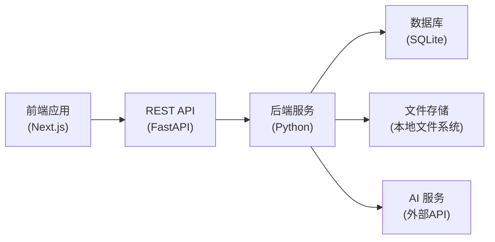

# BananaLecture API 文档

**API 版本**: v1
**基础路径**: `/api/v1`
**文档版本**: 1.0.0
**更新日期**: 2026-03-26

---

## 概述

### 项目背景

BananaLecture 是一个基于 AI 的 PPT 讲解视频生成系统，模拟角色（如大雄、哆啦A梦）的配音，生成完整的讲解视频。

### 技术架构



### 数据流向

```
创建项目 → 对话生成PPT规划 → 生成图片 → 生成对话项 → 生成音频 → 生成视频
   │           │          │          │          │         │
   ▼           ▼          ▼          ▼          ▼         ▼
  项目      幻灯片列表    图片列表    对话列表     音频文件   最终输出
```

---

## API 索引

### 资源层级

```
projects (项目)
    ├── slides (幻灯片)
    │       ├── image (图片)
    │       ├── dialogues (对话)
    │       │       └── audio (音频)
    │       └── audio (合并音频)
    └── video (视频)
tasks (任务)
```

### 接口总览

| 模块 | 方法 | 路径 | 说明 |
|------|------|------|------|
| **项目** | POST | `/projects` | 创建项目 |
| | GET | `/{user_id}/projects` | 获取项目列表 |
| | GET | `/projects/{project_id}` | 获取项目详情 |
| | PUT | `/projects/{project_id}` | 更新项目 |
| | DELETE | `/projects/{project_id}` | 删除项目 |
| **幻灯片** | POST | `/projects/{project_id}/slides` | 批量创建幻灯片 |
| | GET | `/projects/{project_id}/slides` | 获取幻灯片列表 |
| | PUT | `/projects/{project_id}/slides/{slide_id}` | 更新幻灯片 |
| | DELETE | `/projects/{project_id}/slides/{slide_id}` | 删除幻灯片 |
| | POST | `/projects/{project_id}/slides/reorder` | 重新排序幻灯片 |
| | POST | `/projects/{project_id}/slides/add` | 添加幻灯片 |
| **图片** | POST | `/projects/{project_id}/slides/{slide_id}/image/generate` | AI生成图片 |
| | POST | `/projects/{project_id}/slides/{slide_id}/image/modify` | AI修改图片 |
| | POST | `/projects/{project_id}/images/batch-generate` | 批量生成图片 |
| | GET | `/projects/{project_id}/slides/{slide_id}/image/file` | 获取图片文件 |
| **对话** | POST | `/projects/{project_id}/slides/{slide_id}/dialogues/generate` | AI生成对话 |
| | POST | `/projects/{project_id}/dialogues/batch-generate` | 批量生成对话 |
| | GET | `/projects/{project_id}/slides/{slide_id}/dialogues` | 获取对话列表 |
| | PUT | `/projects/{project_id}/slides/{slide_id}/dialogues/{dialogue_id}` | 更新对话 |
| | DELETE | `/projects/{project_id}/slides/{slide_id}/dialogues/{dialogue_id}` | 删除对话 |
| | POST | `/projects/{project_id}/slides/{slide_id}/dialogues/reorder` | 重新排序对话 |
| | POST | `/projects/{project_id}/slides/{slide_id}/dialogues/add` | 添加对话 |
| **音频** | POST | `/projects/{project_id}/slides/{slide_id}/audio/generate` | 生成幻灯片音频 |
| | POST | `/projects/{project_id}/audio/batch-generate` | 批量生成音频 |
| | GET | `/projects/{project_id}/slides/{slide_id}/dialogues/{dialogue_id}/audio/file` | 获取对话音频 |
| | GET | `/projects/{project_id}/slides/{slide_id}/audio/file` | 获取合并音频 |
| **视频** | POST | `/projects/{project_id}/video/generate` | 生成视频 |
| | GET | `/projects/{project_id}/video/file` | 获取视频文件 |
| **任务** | GET | `/tasks/{task_id}` | 获取任务信息 |
| | DELETE | `/tasks/{task_id}` | 取消任务 |

### 通用参数说明

| 参数位置 | 参数名 | 类型 | 必填 | 说明 |
|----------|--------|------|------|------|
| 路径 | `user_id` | string | 是 | 用户ID |
| 路径 | `project_id` | string | 是 | 项目ID |
| 路径 | `slide_id` | string | 是 | 幻灯片ID |
| 路径 | `dialogue_id` | string | 是 | 对话ID |
| 路径 | `task_id` | string | 是 | 任务ID |
| 查询 | `page` | integer | 否 | 页码，默认1 |
| 查询 | `page_size` | integer | 否 | 每页数量，默认20，最大100 |

### 时间字段说明

- `projects`、`slides`、`dialogues`、`tasks` 的 `created_at` 与 `updated_at` 均使用 UTC ISO 8601 字符串，例如 `2026-03-26T10:00:00Z`

---

## 通用响应格式

### 成功响应

```json
{
  "code": 200,
  "message": "success",
  "data": { ... }
}
```

### 错误响应

```json
{
  "code": 400,
  "message": "错误描述",
  "data": null
}
```

### 异步任务响应

对于需要长时间运行的操作（如生成图片、音频、视频），返回异步任务响应：

```json
{
  "code": 202,
  "message": "任务已创建",
  "data": {
    "task_id": "task-550e8400-0001",
    "project_id": "550e8400-e29b-41d4-a716-446655440000"
  }
}
```

对于同步成功但无额外负载的接口，实际响应同样保持统一结构：

```json
{
  "code": 200,
  "message": "操作成功",
  "data": null
}
```

---

## 详细文档

- [数据库设计](DB.md) - 数据库表结构和字段说明
- [存储方案](storage.md) - 逻辑存储键、本地文件布局与开发约束
- [接口](api)
  - [项目接口](api/project.md) - 项目的增删改查
  - [幻灯片接口](api/slide.md) - 幻灯片的管理
  - [图片接口](api/image.md) - 图片生成、修改和获取
  - [对话接口](api/dialogue.md) - 对话内容管理
  - [音频接口](api/audio.md) - 音频生成和获取
  - [视频接口](api/video.md) - 视频生成和获取
  - [任务接口](api/task.md) - 异步任务管理
